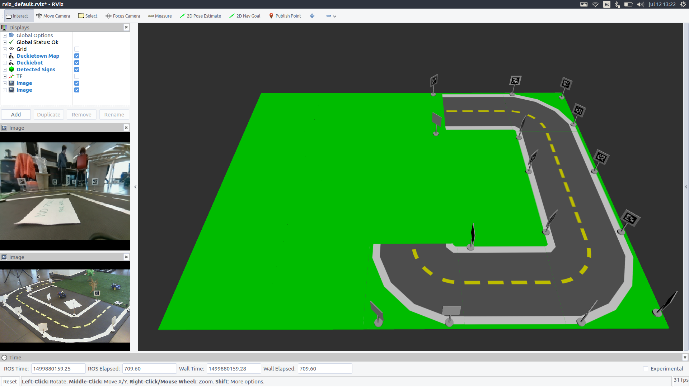

<h1>Guia De localizacion</h1>

<h2>Archivos</h2>

* <h4>Duckie_core.launch</h4>

Este archivo tipo launch, activa los motores y ejecuta los nodos [joy_control](#joy_control),
[duck_detector](#duck_detector) y [controller](#controller), ademas de `Apriltags.launch`

* <h4>Apriltags.launch</h4>

Activa la camara, y la deteccion de apriltags.

* <h4>Joy_control</h4>

Este nodo se encarga de entregar los datos del control.
* <h4>Duck_detector</h4>

Este nodo realiza la captacion de imagen, por parte de la camara, para ver si se encuentra un pato al frente, y entrega su 
posicion.
* <h4>Controller</h4>

Este toma los datos de ambos nodos (`joy_control` y `duck_detector`), para que el duckiebot se pueda mover 
sin atropellar a un pato.

<h2>Procedimiento</h2>

1.**Iniciar mediante ssh al duckiebot**

2.**Usar el comando `./hotspot.sh on`**

Deja al robot movible, con el uso de WI-FI. 
*Indicacion*: Se quedará pegada la terminal al correr el codigo. Se requiere reiniciar,y conectar mediante Wi-fi 

3.**Correr `Byoubu`**

*Indicacion*: Con `F2` se abren nuevas pestañas, y `F3` para cambiar.

4.**Correr el codigo `roslaunch ros_cap duckie_core.launch`**

Se inician los nodos del ***duckie_core.launch***, explicados al [inicio.](#archivos)
 Se prenden los motores, para su uso mediante el control, además de la camara para detectar apriltags.  

5.**Usar el codigo en el pc `roslaunch duckietown_description duckietown_description_node.launch veh:=duckiebot`**

Este launch lanzará el mapa 3D en ***Rviz***, para su visualizacion.

6.**Listo para usar**:sunglasses: :hatched_chick:
   
